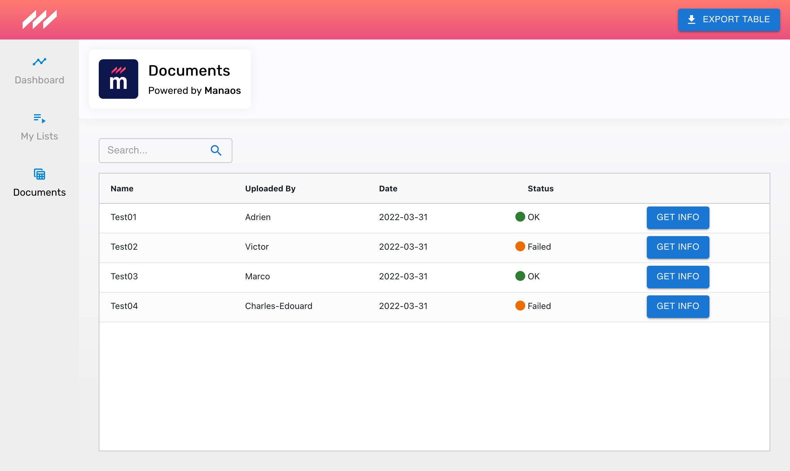

# Exercise in Manaos templating

In this github repository, you have to produce a website template which matches with Manaos by using its current libraries. The exercise must last half a day, you should send a pull request with your code that follows the next required requests.

Please start by cloning this repo.

## Target

You must display your Documents page so that it looks like this screenshot:

> If you can not display this picture, you can find it in this repo at `./src/static/pictures/screenshot.png`.

## Resources

Now that you have cloned the repo, you can find the static resources (fonts, pictures) in the `src/static` folder.

## Your level

### **Developers starting Web Development**

Sorry, another exercise will be transfered soon, or please ask at my email.

#

### **React/Typescript Beginners**

As a beginner, you have to:

- Go to branch `stable`
- Create and go to your branch `candidate-{names}-{firstnames}` in spinal-lowercase only.
- Develop the app:
  1. [X] Create a route `/documents` to a new component `DocumentsView`.
  2. [X] Use AG-Grid library to setup a table
  3. [X] Use MaterialUI to create the button "Export Table" and the search input.
  4. [X] Use CSS-in-JS to create CSS classes (example in `/src/sample/Example.tsx` and `/src/sample/Example.style.ts`).
  5. [X] Create the Document page following screenshot above.
  6. [X] Call `api.getDocuments` to get data and display it in AG-Grid.
- [X] Take a screenshot of your `/documents` page in your localhost server.
- [] Send code and commits in a new pull request through branch you setup with your screenshot in description.

#

### **React/Typescript Regulars**

As a regular Web developer using React hooks and Typescript, you have to accomplish beginners tasks but starting with branch `main` (only mock api in `/src/api` and static files in `/src/static`).

> We assume that you can cheat by using the code of the `stable` branch, but remember that we wrote this entire exercise which will be compared, and that technologies evolve their syntax and libraries.

As a regular developer, you have to:

- Stay in branch `main`
- Create and go to your branch `candidate-{names}-{firstnames}` in spinal-lowercase only.
- Develop the app:
  1. Setup a website project in CSR with libraries TypeScript, React, ReactRouter, AG-Grid (`ag-grid-react`), MaterialUI.
  2. Create the Documents page at `/documents` to look like screenshot above, with table built with AG-Grid and components built with MaterialUI.
  3. Call `api.getDocuments` to get data and display it in AG-Grid, display a loader while loading data, display an error message if call fails, then make calls 3 seconds apart.
  4. Use React Portals to bind button "Export Table" in header.
  5. Create a custom hook for updating component state following `api.getDocuments` call state and reload automatically data.
  6. Create a React Context to storage the search value, so when your route change, the search still the same (without redux is prefered).
- Take a screenshot of your `/documents` page in your localhost server.
- Send code and commits in a new pull request through branch you setup with your screenshot in description.

#

### **Specialists & Tech Leaders**

As a specialist Web developer using React hooks and Typescript, you have to accomplish beginners & regular developers tasks starting with branch `main` (only mock api in `/src/api` and static files in `/src/static`).

> We assume that you can cheat by using the code of the `stable` branch, but remember that we wrote this entire exercise which will be compared, and that technologies evolve their syntax and libraries.

As a specialist developer, you have to:

- Stay in branch `main`
- Create and go to your branch `candidate-{names}-{firstnames}` in spinal-lowercase only.
- Develop the app:
  1. Setup a website project in CSR with libraries TypeScript, React, ReactRouter, AG-Grid (`ag-grid-react`), MaterialUI.
  2. Create the Documents page at `/documents` to look like screenshot above, with table built with AG-Grid and components built with MaterialUI.
  3. Call `api.getDocuments` to get data and display it in AG-Grid, display a loader while loading data, display an error message if call fails, then make calls 3 seconds apart.
  4. Use React Portals to bind button "Export Table" in header.
  5. Create a custom hook for updating component state following `api.getDocuments` call state and reload automatically data.
  6. Create a React Context to storage the search value, so when your route change, the search still the same (without redux is prefered).
  7. Setup Jest/TestingLibrary and code some unit tests
  8. Setup Cypress and code some functional tests
  9. Configure a monorepo to call MaterialUI components in a package, to call api in second package, and write Cypress tests in a thrid package.
  10. Configure Storybook for components package.
- Take a screenshot of your `/documents` page in your localhost server.
- Take video produced by Cypress for your functional test.
- Send code and commits in a new pull request through branch you setup with your screenshot and video in description.

#

### **Above & beyond**

Sorry, we are not ready yet for expert exercises! You can at least follow beginners, regulars and specialists tasks, then try to explain React engine and optimizations.
